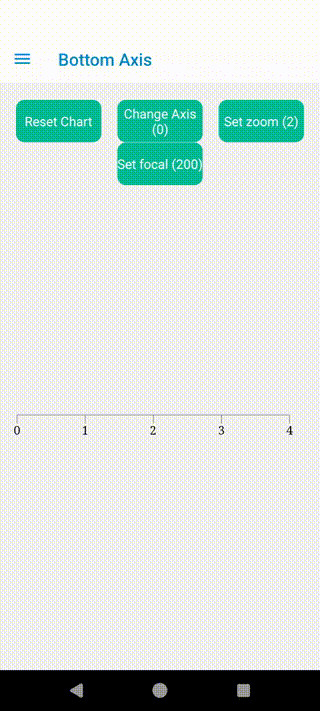

# Obi-chart

React Native charts using react-native-skia

## Installation

```sh
npm install obi-chart
```

## Animations


### 1. Bottom Axis




## Usage


See [example](example)


## Contributing

See the [contributing guide](CONTRIBUTING.md) to learn how to contribute to the repository and the development workflow.

## License

MIT

---

Made with [create-react-native-library](https://github.com/callstack/react-native-builder-bob)
