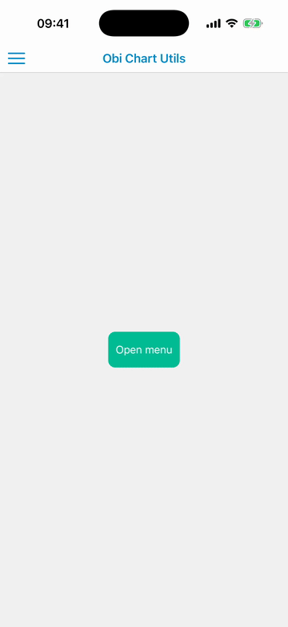
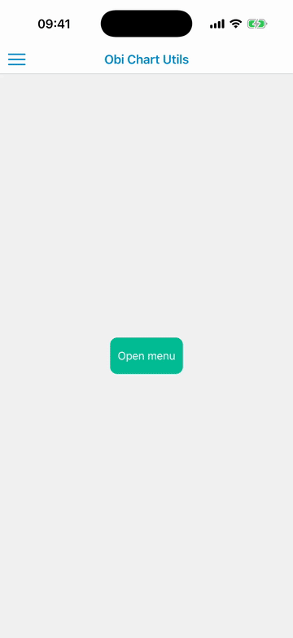

# @obitrain/charts

React Native charting primitives built on [React Native Skia](https://shopify.github.io/react-native-skia/),
[Reanimated](https://docs.swmansion.com/react-native-reanimated/) and
[Gesture Handler](https://docs.swmansion.com/react-native-gesture-handler/): animated line charts, a
zoomable/pannable variant, a scalable bottom axis and a cursor, all driven from the UI thread.

## Installation

```sh
yarn add @obitrain/charts
yarn add @shopify/react-native-skia react-native-reanimated react-native-worklets react-native-gesture-handler d3-scale d3-shape
```

`react-native-worklets` is only needed with Reanimated 4 (it is an optional peer dependency).

## Requirements

| Peer dependency              | Supported versions                                    |
| ---------------------------- | ----------------------------------------------------- |
| `@shopify/react-native-skia` | `>=2.0.0 <3.0.0`                                       |
| `react-native-reanimated`    | 3.x or 4.x                                             |
| `react-native-worklets`      | `>=0.10.0` (optional, required with Reanimated 4)      |
| `react-native-gesture-handler` | 2.x or 3.x                                           |
| `d3-scale`                   | `>=4.0.2 <5.0.0`                                       |
| `d3-shape`                   | `>=3.2.0 <4.0.0`                                       |
| `react`                      | 18.x or 19.x                                           |
| `react-native`               | 0.61.5 up to 0.87                                      |

The exact ranges live in the `peerDependencies` of `package.json`. Development and tests run on
Expo SDK 57 / React Native 0.86 / Node `>= 20.19.4`.

## Usage

### Static line chart

`buildGraph` converts raw `[x, y][]` data into a `GraphData` (Skia path, data points, d3 scales).
`LineChart` renders one (`path`) or several (`paths`) paths on a Skia canvas:

```tsx
import { buildGraph, LineChart } from '@obitrain/charts';

const WIDTH = 300;
const HEIGHT = 140;

const data: [number, number][] = [
  [0, 10],
  [1, 25],
  [2, 18],
  [3, 40],
];

const graph = buildGraph(data, WIDTH, HEIGHT);

export function MyChart() {
  return (
    <LineChart
      path={graph.skiaPath}
      width={WIDTH}
      height={HEIGHT}
      color="dodgerblue"
    />
  );
}
```

### Zoomable line chart

`useScalableGesture` provides the `scale`, `focalX` and `offsetX` shared values plus the pinch/pan
gestures to wire into a `GestureDetector`:

```tsx
import {
  buildGraph,
  useScalableGesture,
  ZoomableLineChart,
} from '@obitrain/charts';
import { Gesture, GestureDetector } from 'react-native-gesture-handler';
import { useSharedValue } from 'react-native-reanimated';

export function MyZoomableChart() {
  const graph = buildGraph(data, WIDTH, HEIGHT);
  const path = useSharedValue(graph.skiaPath);

  const { scale, focalX, offsetX, pinchGesture, panGesture } =
    useScalableGesture({ width: WIDTH });

  const gesture = Gesture.Simultaneous(pinchGesture, panGesture);

  return (
    <GestureDetector gesture={gesture}>
      <ZoomableLineChart
        width={WIDTH}
        height={HEIGHT}
        {...{ path, scale, focalX, offsetX }}
      />
    </GestureDetector>
  );
}
```

## What's inside

**Components** — `BottomAxis`, `AxisLine`, `Tick`, `Cursor`, `LineChart`, `ZoomableLineChart`,
`ScalablePath`.

**Hooks** — `useScalableGesture` (pinch/pan into a shared `scale`/`focalX`/`offsetX`),
`useCursorGesture` (continuous or discrete cursor), `useUpdateAxis` (swap axis labels on scale
thresholds), `useDotsTransition` (animate dots along a path), `useSharedNumberToStr`.

**Graph helpers** — `buildGraph`, `scaleCommands`, `getClosestPoint`, `getPositionWl`,
`defaultOpacityTransitionWl`, `defaultTranslateTransitionWl`.

**Math helpers** — `commandsToBezier`, `cubicBezierYForX`, `getYForX`, `magnitude`, `normalize`,
`selectCurve`.

**Date helpers** — `getMonthInterval`, `getDateInterval`, `getDateBoundaries`, `sampleDates`,
`sampleDatesByRange`.

**Types** — `AnimatedDot`, `DataPoint`, `LineGraphType`, `GraphData`, `Config`, `LinePath`,
`DateRange`, plus the component/hook prop types (`CursorProps`, `LineChartProps`,
`ZoomableLineChartProps`, `UseCursorGestureProps`, `UseDotAnimationProps`).

## Examples

### Bottom axis


`BottomAxis` with `useScalableGesture` and `useUpdateAxis`: zooming swaps the label set to match the
current scale. From `example/src/screens/BottomAxisScreen.tsx`.

### Line chart


`LineChart` interpolating between three paths, with animated dots and a `Cursor` — single path, then
several paths at once. From `example/src/screens/LineChartScreen`.

### Zoomable line chart



`ZoomableLineChart` with pinch/pan and a programmatic zoom onto a period between two data points.
From `example/src/screens/ZoomableLineChartScreen`.

### Dots


Dot transitions between data sets of different lengths, the primitive behind `useDotsTransition`.
From `example/src/screens/DotsScreen`.

### Advanced chart



`AxisLine` + `Tick` + a Y axis and dots composed in a single Skia canvas, with a shared scale driven
by gestures or sliders. From `example/src/screens/AdvancedChartScreen`.

## Example app

```sh
yarn
yarn example ios     # or: yarn example android
```

Every demo screen is reachable through the `obichart://` scheme. Appending `?demo=1` replays a
scripted sequence of interactions on that screen (used to record the GIFs above):

```sh
xcrun simctl openurl booted "obichart://line-chart?demo=1"
```

Slugs: `bottom-axis`, `line-chart`, `zoomable-line-chart`, `dots`, `advanced-chart`.

## Regenerating the GIFs

```sh
yarn gifs                                  # all screens, builds the app in Release
yarn gifs --skip-build dots line-chart     # reuse the installed app, only these screens
yarn gifs --device "iPhone 17 Pro"
```

Requires Xcode with an iOS simulator, `ffmpeg` and `jq`. The script boots the simulator, freezes the
status bar, drives each screen through its deep link and writes `static/<slug>.gif`.

## Releasing

Releases are automated from conventional commits. Every push to `main` updates a "Release" pull
request (release-please) with the next version and changelog; merging it tags the release, creates the
GitHub release and publishes `@obitrain/charts` to npm from CI via trusted publishing, so no npm token
or one-time password is involved.

One-time setup on npmjs.com, under the package's *Settings → Trusted publishing*: add a GitHub Actions
publisher for `Obitrain/obi-chart` with workflow `release.yml`.

## Contributing

See the [contributing guide](CONTRIBUTING.md) to learn how to contribute to the repository and the development workflow.

## License

MIT
