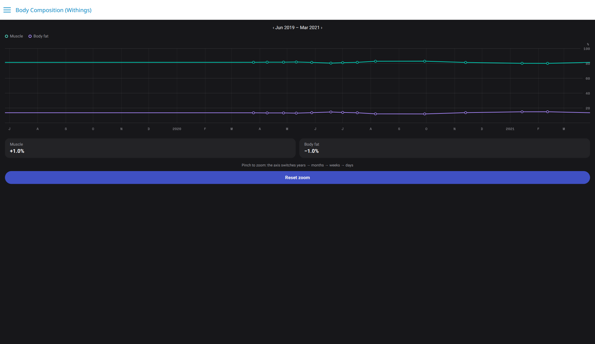
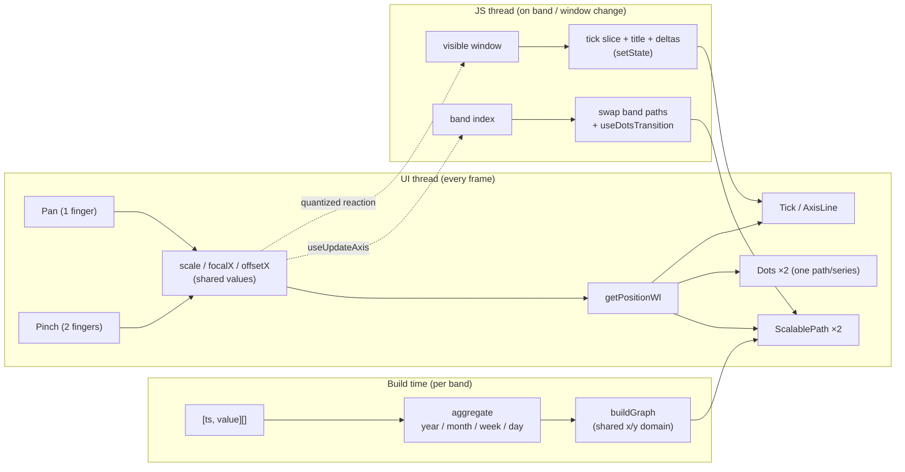
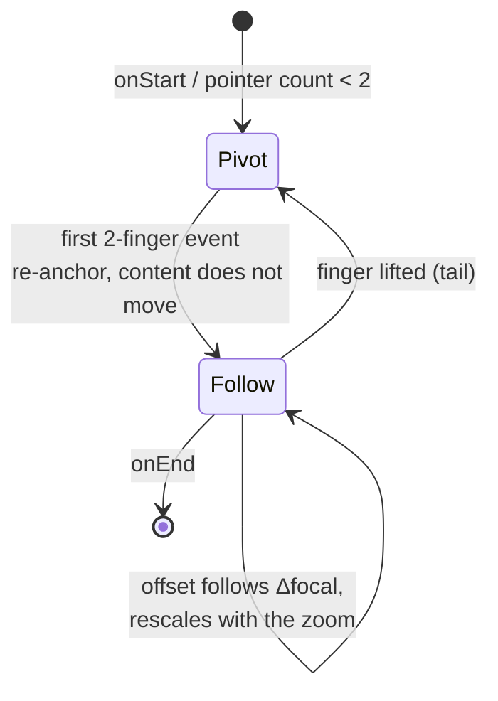

# Body Composition chart (Withings-style)

The `BodyCompositionScreen` example ([example/src/screens/BodyCompositionScreen](../example/src/screens/BodyCompositionScreen)) reproduces the Withings body-composition chart: two series with hollow markers (a ring for muscle, a diamond for body fat), a percentage grid, and a pinch-to-zoom interaction where both the data bucketing and the axis labels adapt to the visible window. Colours come from a `Theme` object with a light and a dark palette, picked from the system scheme and switchable from the header.



It is built entirely from library primitives; this document explains how the pieces fit together and the design decisions behind the gesture and rendering layers.

## Architecture

Raw data is bucketed at several granularities (one per zoom band) and turned into Skia paths by `buildGraph`. Each band plots the **mean per bucket** at the mean timestamp of its measurements, so markers land on period boundaries rather than on arbitrary samples. Gestures only write three shared values — `scale`, `focalX`, `offsetX` — and everything drawn on the canvas derives its position from them on the UI thread, frame by frame. React state is only involved when the zoom band or the visible window changes.



### The screen-space transform

Every x position goes through one worklet ([`getPositionWl`](../src/Charts/gesture.ts)):

```
x' = (x - focalX) · scale + focalX + offsetX
```

`focalX` is the screen pivot of the zoom, `offsetX` the pan translation. `ScalablePath` applies the equivalent affine matrix to whole paths; `Dots` and `Tick` apply it per element.

## Gestures

### Pan: live clamping, no snap-back

The pan accumulates incremental deltas (`event.changeX`) and clamps the offset **during the drag** against the bounds that keep the content edges pinned to the viewport ([`getOffsetBoundsWl`](../src/Charts/gesture.ts)):

```
maxOffset = startOffset + focalX · (scale - 1)        // left data edge at the left border
minOffset = startOffset + (1 - scale) · (width - focalX)  // right data edge at the right border
```

At `scale = 1` the interval collapses to a single point, so panning an unzoomed chart is simply inert. This replaces the previous design (free overscroll + animated snap-back in `onEnd`), which produced two artifacts measured on device: a full-width rubber-band on every unzoomed pan, and an instantaneous teleport when re-grabbing during the 300 ms snap animation (the next pan's base was already committed to the animation target).

### Pinch: the glued-fingers invariant

The defining property of a correct two-finger zoom is that **the content under each finger stays under that finger** — this is what makes the chart "zoom on what you focus". Scaling around a fixed focal is not enough: a natural pinch is asymmetric, so the focal (the fingers' centroid) moves while zooming, and when `offsetX ≠ 0` even a pure scale change shifts the content under the focal.

The discrete update that satisfies the invariant between two events `(f₁, s₁) → (f₂, s₂)` is:

```
offsetX₂ = (f₂ - f₁ + offsetX₁ / s₁) · s₂
```

with one exception: on the **first** event of a gesture (and when recovering from a one-finger tail), the focal jump is a re-anchoring, not finger movement, so the offset is instead rebased to keep all content stationary:



Both branches end with the same bounds clamp as the pan, so zooming out at a data edge keeps the edge pinned. The invariant is locked by a step-by-step simulation test in [gesture.test.ts](../src/__tests__/gesture.test.ts) (`pinch focal math`) asserting both finger anchor points track exactly through a 20-step asymmetric pinch.

The pan is restricted to `maxPointers(1)`: two fingers belong to the pinch, whose follow-rebase already provides two-finger panning. Letting both handlers write `offsetX` (the previous `Gesture.Simultaneous` behaviour) made the pan's absolute writes discard the pinch rebase.

## Adaptive axis (zoom bands)

Band thresholds are expressed in *visible window duration*, converted to scale values once (`BAND_SCALES` in [data.ts](../example/src/screens/BodyCompositionScreen/data.ts)):

| Band | Visible window | Data bucket | Axis ticks |
| --- | --- | --- | --- |
| years | > 2 years | one point per year | Jan 1st, year label |
| months | 4 months – 2 years | one point per month | 1st of month, narrow month (year on Jan) |
| weeks | 6 weeks – 4 months | one point per week | 1st of month, full month name |
| days | < 6 weeks | every measurement | Mondays, short weekday + day |

`useUpdateAxis` watches `scale` on the UI thread and fires once per band crossing; the screen swaps the band's pre-built paths into the rendered shared values and `useDotsTransition` animates the dot set to the new sampling.

### Windowed ticks

Tick labels for all four granularities are **precomputed once** at mount (Date/Intl formatting mid-gesture cost 10–50 ms per regeneration on the JS thread). While panning:

- years/months render their full set with a stable array identity — no re-render at all;
- weeks/days are sliced to the visible window ± one window of buffer, refreshed by a UI-thread reaction quantized to half-window crossings (so panning fires a `setState` at most twice per window traversed).

## Performance notes

Skia works in retained mode: re-rendering React components is the expensive path, while animating values through worklets is nearly free. The screen therefore keeps everything gesture-driven on the UI thread and minimizes what React re-renders:

- **One Skia call per marker.** A diamond built from four `moveTo`/`lineTo` calls costs four JSI hops per dot per frame; `addPoly` does it in one. The worklet rebuilds every visible dot on every frame of a gesture, so this multiplies quickly.
- **`Dots` over per-dot components.** 240 `Dot` components each run a worklet and update ~2 Skia nodes per frame; on a OnePlus Nord this held zoomed pans at an 18 ms median frame (74% janky on the 90 Hz panel). [`Dots`](../src/Charts/Dots.tsx) rebuilds one `SkPath` per series in a single worklet (with off-screen culling), bringing the median to 5 ms (2.3% janky). The trade-off: per-dot opacity is binary (the 200 ms fade of individual dots becomes a snap).
- **Stable gesture instances.** `useScalableGesture` memoizes its `Pan`/`Pinch` objects: handing new instances to `GestureDetector` mid-gesture resets the active pan.
- **Stable reactions.** `useDotsTransition` and `useUpdateAxis` take explicit dependencies (and a ref-based dispatcher for the latter), so mid-pan re-renders don't tear down and re-fire UI-thread reactions.

## Library additions

| Export | Purpose |
| --- | --- |
| `Dots` | A whole dot series as one Skia path (two with `fillColor` for the hollow-ring look); `shape` selects `circle` or `diamond` |
| `Dot` | Single marker, zoom-aware, true per-dot opacity animation |
| `YAxis` | Horizontal gridlines with right-side labels (`values`/`nbTicks`, `formatLabel`) |
| `getOffsetBoundsWl` | The pan/pinch offset bounds worklet |
| `Tick` | Now themeable; a negative `tickLength` draws a full-height vertical gridline, `dash` makes it dashed and `labelAlign="left"` puts the label beside the tick instead of under it |
| `BottomAxis` | Takes `ticks` at explicit positions (a time axis lands on month starts or Mondays, not on even fractions of the width) alongside the original evenly-spaced `labels`, forwards the tick styling props, and with `standalone={false}` renders into an existing `Canvas` instead of its own |
| `YAxis` / `getPaddedTicks` | Horizontal gridlines with right-side labels; `getPaddedTicks` derives evenly spaced ticks from 0 up to a padded maximum (e.g. 0, 26, 52, 78, 104) |
| `Cursor` | Optional `strokeColor` / `strokeWidth` draw a ring around the marker |

## Known limitation: the raw-measurement overlay

Withings' fullscreen view draws a faint grey line through every raw measurement behind the bucketed line. Adding it as two more `ScalablePath` layers (a `curveBasis` path over all 156 points per series) made the app ANR reliably on Android whenever the zoom was reset from the deepest band back to years.

This was confirmed by a controlled comparison on a `sdk_gphone64_arm64` emulator (API 34, debug build): the pre-change code reset instantly, the change with the overlay ANR'd on every reset, and the same change with only the overlay removed reset instantly again.

`ScalablePath` copies and transforms its whole path on every frame, so two extra long paths land on the UI thread exactly when a band change is already animating every dot. The overlay is therefore not implemented yet. The likely fix is to give the raw line the same band treatment as the aggregate paths — build a decimated version per band and swap it in `onScaleChange` — rather than drawing one full-resolution path at every zoom level.

## Measured: what a zoom actually costs

Profiled on an iOS simulator (debug build, so roughly 3x slower than release) over an 18.5s session: three band-crossing pinches, two pans and a reset.

| | Before | After |
| --- | --- | --- |
| React commits over 16ms | 14 of 34 | 4 of 51 |
| Fiber renders | 5527 | 2277 |
| `Tick` renders / cost | 826 / 165.9ms | drops out of the top table |

Panning and pinching inside a band cost nothing in React — the screen component rendered 3 times in the whole session, because zoom and pan only move shared values.

The first profile showed every hot commit blaming `Tick` with "props: dash". The screen passed `dash={[3, 4]}` as an inline array, and since `Tick` is memoized a fresh array reference on each render defeated the memo and re-rendered all 74 ticks. `BottomAxis` now memoizes the dash pair on its values, so a caller writing the array inline (the natural way to write JSX) no longer breaks the memo.

What remains is **mount** cost, not re-render cost: a band change or a pan that pulls new ticks into the window mounts 17–74 `Tick` components, and the worst such commit spent 142ms inside `runOnUISync`. Each `Tick` owns a `useDerivedValue`, so mounting N ticks registers N shared values on the UI thread. This is the same problem `Dots` already solved by collapsing a whole series into one path and one worklet; the gridlines could be collapsed the same way, leaving only the labels as per-tick components.
